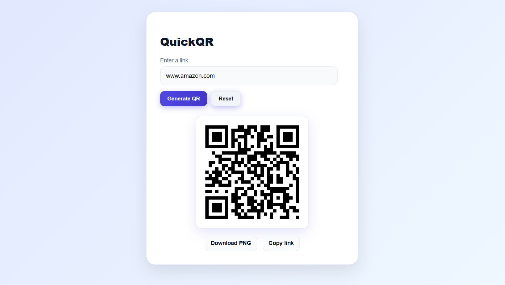

# 🔍QuickQR

A fast, elegant, and secure QR Code Generator built using **React.js** and **Express.js**.  
Simply enter a valid URL and generate a QR code instantly.  
The app verifies whether the URL is **real and exists** using live DNS lookup, ensuring only authentic domains are accepted.

---

##  Features

-  **Instant QR generation**
-  **Strict URL validation** (format + real-domain DNS verification)
-  **Block Invalid URLs**
-  **Fast response**
-  **Download QR as PNG**
-  **Copy original link**
-  **Elegant and responsive UI**
-  **Full-stack project (React + Express)**

---

##  Tech Stack

### **Frontend**
- React.js  
- JavaScript (ES6+)  
- Vite  
- CSS  

### **Backend**
- Node.js  
- Express.js  
- DNS module (Node)
- QRCode library  

---

### **Procedure to run the project locally**

Follow these steps to run the project on your local machine:

**Clone the repository**
```bash
git clone https://github.com/YOUR-USERNAME/YOUR-REPO.git
```

**Navigate into the project folder**
```bash
cd YOUR-REPO
```

## ▶️ Start the Backend (Express Server)

**1️⃣ Go to the server folder**
```bash
cd server
```

**2️⃣ Install dependencies**
```bash
npm install
```

**3️⃣ Start the backend server**
```bash
npm start
```
<p>Your backend will now be running at:</p>

```bash
http://localhost:4000/
```

## ▶️ Start the Frontend (React App)

**4️⃣ Open a new terminal window, then go to the client folder**
```bash
cd client
```

**5️⃣ Install frontend dependencies**
```bash
npm install
```

**6️⃣ Start the React development server**
```bash
npm run dev
```

<p>Your frontend will now be running at:</p>

```bash
http://localhost:5173/
```

## Preview <p align="center">  

<br>

*Feel free to fork this repository and open PRs for improvements.*

